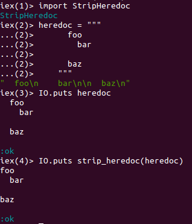

# strip_heredoc

[](https://travis-ci.org/wnuqui/strip_heredoc)
[](http://inch-ci.org/github/wnuqui/strip_heredoc) [](https://github.com/wnuqui/strip_heredoc/releases/latest) [](https://hex.pm/packages/strip_heredoc)

`strip_heredoc` is a one-method utility library for Elixir projects that needs to strips indentation in heredocs. This is a direct Elixir port from Rails!

The complete documentation for `strip_heredoc` is located [here](https://hex.pm/packages/strip_heredoc).

### Adding strip_heredoc To Your Project

To use `strip_heredoc` with your projects, edit your `mix.exs` file and add it as a dependency:

```elixir
defp deps do
  [{:strip_heredoc, "~> 0.7.0"}]
end
```

### Examples

To use `strip_heredoc`, add
```elixir
import StripHeredoc
```
to the top of the module so you can use `strip_heredoc/1` function.

Example:



## License

This software is licensed under [the MIT license](LICENSE.md).
